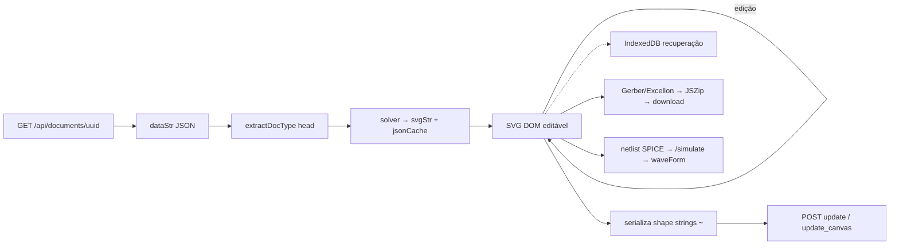

# 09 — Fluxos de dados

```mermaid
flowchart LR
  A[GET /api/documents/uuid] --> B[dataStr JSON]
  B --> C[extractDocType head]
  C --> D[solver → svgStr + jsonCache]
  D --> E[SVG DOM editável]
  E -->|edição| E
  E --> F[serializa shape strings ~]
  F --> G[POST update / update_canvas]
  E -.-> H[IndexedDB recuperação]
  E --> I[Gerber/Excellon → JSZip → download]
  E --> J[netlist SPICE → /simulate → waveForm]
```
Os passos A–D e I estão confirmados no código. O F–G (serialização e salvamento) é INFERIDA: os endpoints existem, mas a sequência não foi observada.
